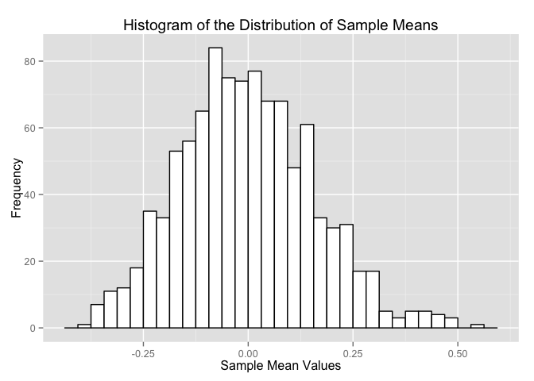

# An Analysis of the Properties of the Exponential Distribution and Demonstration of the CLT
Connor M  
March 15, 2015  

## Introduction  

It will be the purpose of this report to compare and contrast the following:  

1. The mean of a sample drawn from an exponential distribution and the mean of the theoretical exponential distribution said sample was drawn from.  
2. The variance of a sample drawn from an exponential distribution and the variance of the theoretical exponential distribution said sample was drawn from.  

We will also show how the distribution of a large amount of sample means drawn from an exponential distribution approximately follows a gaussian (normal) distribution. This phenomenon is described by the Central Limit Theorem (CTL).  

## Sample Mean vs. Population Mean
*Note: For the purposes of this report, the distribution for which all samples will be drawn from will be an exponential distribution with $\lambda = 0.2$. i.e. $X \sim Exp(\lambda = 0.2)$*

The expected value (or mean) of an exponential distribution is $E(x) = \frac{1}{\lambda}$. Since $\lambda = 0.2$ for our theoretical distribution, the mean will be 5. Similarly, the standard deviation of our theoretical distribution is also $\frac{1}{\lambda}$ therefore $\sigma = 5$.  
  
\[\mu = E(X) = \frac{1}{\lambda} = \frac{1}{0.2} = 5\]  

\[\sigma = \frac{1}{\lambda} = \frac{1}{0.2} = 5\]  

Our first task is to compare the theoretical mean of our exponential distribution to the mean of a sample drawn from our population distribution.

Let's first start with generating a random sample drawn from our exponential distribution.


```r
# Set the seed so the results are reproduciable
set.seed(12345)

small_sample <- rexp(n = 40, rate = 0.2)
```

This sample is relatively small (sample size of 40). The sample mean may or may not be close to the population mean, since the sample size is so small. 


```r
mean(small_sample)
```

```
## [1] 5.553693
```

As you can see, the mean of this small sample are *kind of* close to the population mean, but not exactly. We can, however, generate a sample that will be have a sample mean that will be close to the population mean. The Law of Large Numbers states that "the average of the results obtained from a large number of trials should be close to the expected value, and will tend to become closer as more trials are performed.^[Law of large numbers. (n.d.). In Wikipedia. Retrieved March 15, 2015, from http://en.wikipedia.org/wiki/Law_of_large_numbers]" Let's generate a large sample now.


```r
large_sample <- rexp(n = 100000, rate = 0.2)
```

Here's the mean of the sample:


```r
mean(large_sample)
```

```
## [1] 4.990497
```

The sample mean and the mean of the population distribution are very close to one another. 

## Sample Variation vs. Population Variation

Let's take a look at the spread of sample distribution and the population distribution via the standard deviation. We are going to be using the standard deviation as opposed to the variation for examining the variation of each distribution because the units will not be squared.


```r
sd(small_sample)
```

```
## [1] 6.475255
```

```r
sd(large_sample)
```

```
## [1] 4.991409
```

The standard deviation of the small sample distribution isn't very close to the population distribution's standard deviation, which is expected, since the sample size is small. The standard deviation of the large sample distribution is almost the same as the population's, which is a consequence of the Law of Large Numbers.

## Distribution of Sample Means

We will now investigate the distribution of sample means. The Central Limit Theorem (CLT) states "the arithmetic mean of a sufficiently large number of iterates of independent random variables, each with a well-defined expected value and well-defined variance, will be approximately normally distributed, regardless of the underlying distribution.^[Central Limit Theorem. (n.d.). In Wikipedia. Retrieved March 15, 2015, from http://en.wikipedia.org/wiki/Central_limit_theorem]" Let's examine this claim empirically.

First, let's generate 1000 samples of size 40 from our population distribution. The rows in the following matrix correspond to each sample and the columns correspond to each random variable. Next, let's compute the mean of each sample and store the results in a data frame.


```r
# 1000 by 40 matrix
sample_matrix <- matrix(rexp(40000, 0.2), 1000)
average_means <- data.frame(avg_means = rowMeans(sample_matrix))
```

Based on the CLT, this distribution of sample means should be approximately normal. Let's visualize the distribution via a histogram: 


```r
library(ggplot2)

# Find the standard score of each average
mu <- 5 
sigma <- 5
standardized_means <- (average_means - mu) / sigma

ggplot(standardized_means, aes(x = standardized_means$avg_means)) + 
    geom_histogram(colour = "black", fill = "white") +
    ggtitle("Histogram of the Distribution of Sample Means") +
    ylab('Frequency') +
    xlab('Sample Mean Values')
```

 

Based on the histogram, the distribution of averages appears to be normal despite the fact that the samples were drawn from an exponential distribution!
